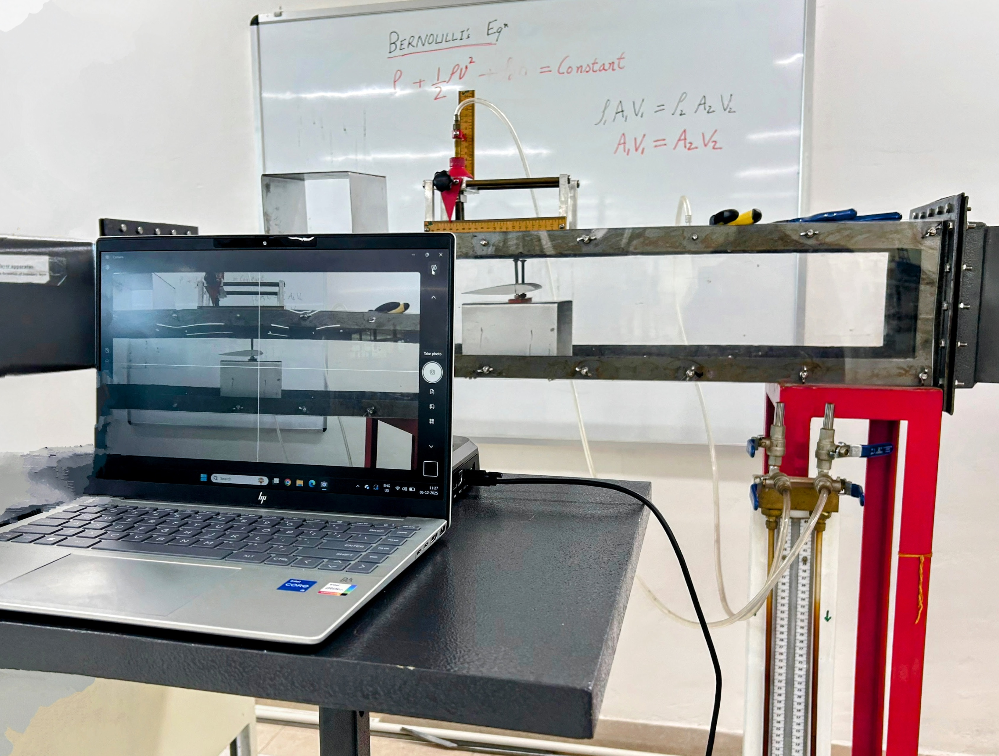

# Powered Lift Wing & Propeller Design
### Inter IIT Tech Meet 14.0 | LAT Aerospace Problem Statement


---

## Overview

This repository contains our complete solution to the **Powered Lift Wing & Thrust Plant Design** problem statement presented by **LAT Aerospace** during **Inter IIT Tech Meet 14.0**.

The objective was to design an innovative powered-lift fixed-wing architecture capable of generating extremely high lift coefficients while maintaining efficient cruise performance for future **Short Take-Off and Landing (STOL)** aircraft.

Our solution combines:

- Distributed Electric Propulsion (DEP)
- Blown Flap Technology
- Mathematical Aerodynamic Modeling
- Blade Element Momentum Theory (BEMT)
- Computational Fluid Dynamics (CFD)
- Structural Analysis
- Numerical Optimization

The entire design pipeline was built from first principles and validated using analytical models together with CFD simulations.

---


# Problem Statement

Design a fixed-wing aircraft integrated with a thrust-producing system capable of generating exceptionally high lift coefficients while satisfying stringent performance constraints.

Target metrics included:

- Lift Coefficient (CL) ≥ **6.5**
- Lift-to-Drag Ratio > **5** (Takeoff)
- Lift-to-Drag Ratio > **20** (Cruise)
- Minimum Lift = **15 kg @ 20 m/s**
- Fixed-wing only
- No Tilt Rotor
- No VTOL
- Powered Lift mandatory

---

# Our Approach

Instead of directly selecting a conventional STOL configuration, we first performed a comparative study of several high-lift architectures.

## Configurations Studied

- Channel Wing
- Prandtl-D (Bell Spanload)
- Joined Wing
- Distributed Electric Propulsion (DEP)
- Blown Flaps
- Electric Ducted Fans (EDF)
- Open Propellers

After evaluating aerodynamic performance, manufacturability, structural complexity, controllability, and safety, we selected:

> **Distributed Electric Propulsion (DEP) with Blown Flaps**

This architecture provided the best balance between

- High Lift
- Redundancy
- Mechanical Simplicity
- Cruise Efficiency
- Control Authority

---

# Methodology

The project was divided into multiple interconnected modules.

## 1. Wing Design

- Airfoil selection
- Thin Airfoil Theory
- Camber optimization
- Flap modeling
- Blown flap mathematical formulation
- Finite wing corrections

---

## 2. Propulsion System

A comparative analysis was performed between

- Open Propellers
- Electric Ducted Fans

The propulsion model was developed using

- Momentum Theory
- Blade Element Theory
- Blade Element Momentum Theory (BEMT)

The mathematical model predicts

- Thrust
- Torque
- Efficiency
- Power Consumption

The solver was validated against published NACA experimental datasets.

---

## 3. Numerical Optimization

Custom Python solvers were developed for

- Propeller optimization
- Airfoil optimization
- Blade geometry
- Pitch distribution
- Performance prediction

Libraries used include

- NumPy
- SciPy
- Matplotlib

---

## 4. Computational Fluid Dynamics

CFD simulations were performed using **ANSYS Fluent** for

- Propeller Validation
- Wing Validation
- Flap Performance
- Blown Wing Analysis

Studies included

- Mesh Independence
- Pressure Distribution
- Velocity Contours
- Streamlines
- Lift & Drag Validation

---

## 5. Structural Analysis

Structural feasibility of the wing was also analyzed to ensure the high-lift configuration remained mechanically practical.

---

# Repository Structure

This repository contains tools for **Propulsion (BEMT/XFOIL-based propeller analysis)** and **Wing Aerodynamics (VLM/VSM/DEP studies)**.


## 📁 Root Directory


### Root Files
- **requirements.txt** - Python dependencies for the project  
- **README.md** - Project documentation  
- **Additional Files** - Organized files for the project

---

## 🚀 `propulsion/` - Propeller & BEMT Analysis

Tools for **Propeller Design, Analysis, and Optimization** using **Blade Element Momentum Theory (BEMT)** and **XFOIL**.


### Key Files
- **Airfoils/** - Airfoil coordinate data for propeller sections  
- **Propeller/** - Our Arbitrary propeller geometry and related data  
- **bemt_dynamic_airfoil_optimization.py** - BEMT-based Collective and RPM optimization for an arbitrary propeller (with data given in `Propeller/`) 
- **bemt_general_optimization.py** - BEMT-based Collective and RPM optimization for a propeller with a general airfoil (NACA4412)  
- **bemt_rmit.py** - Comparison of our algorithm to the performance observed in the Paper by RMIT
- **bemt_with_xfoil.py** - BEMT coupled with XFOIL for viscous airfoil data  
- **propeller_data.csv** - The propeller performance measurements as observed in the Paper by RMIT  
- **xfoil_final.py** - Python wrapper for running XFOIL  
- **xfoil.exe** - XFOIL executable (Windows)

---

## ✈️ `wing/` - Wing Aerodynamics & DEP Studies

Contains **2D/3D wing aerodynamic solvers**, **DEP (Distributed Electric Propulsion)** simulations, and **vortex methods**.


### Key Files
- **Airfoils/** - Airfoil coordinate files for wing analysis  
- **DEP_2D.py** - 2D DEP aerodynamic analysis  
- **DEP_cruise.py** - Cruise condition analysis for our chosen DEP configuration  
- **DEP_takeoff.py** - Takeoff condition analysis for our chosen DEP configuration  
- **DEP_paper_2D_flat.py** - In the paper by Spence, they mentioned a formula for a flat blown airfoil. This evaluates that formula to get the `Cl` according to his observations.
- **helper.py** - Shared utility function to read camber line from csv
- **VLM_2d.ipynb** - 2D Vortex Lattice Method notebook  
- **VSM_wing.py** - Full Vortex Sheet Method wing model  
- **VSM_wing_simplified.py** - A slightly simplified version of VSM solver  

---

## 🛩️ `wing_no_jet/` - Wing Analysis without Jet/Prop Effects

Wing aerodynamic analysis **Excluding jet/propeller slipstream effects** for baseline comparisons.


### Key Files
- **Airfoils/** - Airfoil datasets  
- **Gamma.py** - Circulation distribution calculation  
- **extraction.py** - Data extraction and post-processing  
- **helper.py** - Utility functions  

---

## 🛩️ `propeller_simulation.zip` - ANSYS simulation of our propeller

Simulation of the optimal takeoff conditions as described by the output of `propulsion/bemt_dynamic_airfoil_optimization.py`.

## 🛩️ `wing_simulation.zip` - ANSYS simulation of our wing without blown effects

Simulation of a 3D wing as described by the output of `wing_no_jet/Gamma.py`.

## 🛩️ `dep_simulation.zip` - ANSYS simulation of our wing with blown effects

Simulation of the optimal wing as described by the output of `wing/DEP_takeoff.py`.

---

## ⚙️ Setup & Usage (Basic)

```bash
# Tools & Software

| Tool | Purpose |
|------|----------|
| Python | Mathematical Modeling |
| NumPy | Numerical Computation |
| SciPy | Optimization |
| Matplotlib | Visualization |
| XFOIL | Airfoil Analysis |
| ANSYS Fluent | CFD |
| OpenVSP | Geometry Development |
| AVL | Preliminary Stability Analysis |

---

# Highlights

- Complete mathematical model for DEP-based STOL aircraft
- Blade Element Momentum Theory implementation
- Airfoil and flap analytical model
- CFD validation of propulsion system
- CFD validation of blown-wing concept
- Structural feasibility analysis
- Constraint optimization framework
- Research-backed design decisions

---

# Results

The proposed architecture successfully demonstrated

- High lift capability through blown flaps
- Efficient DEP-based propulsion
- Good agreement between analytical models and CFD
- Parameterized optimization framework for future improvements

The workflow can be extended for

- Aircraft optimization
- Autonomous STOL vehicles
- Regional Air Mobility (RAM)
- Urban Air Mobility (UAM)

---

# Future Work

- Multi-objective optimization
- Wind tunnel validation
- Aeroelastic analysis
- Flight control integration
- Reinforcement Learning assisted optimization
- Multi-disciplinary Design Optimization (MDO)

---

# References

This project builds upon literature including

- Blade Element Momentum Theory
- Thin Airfoil Theory
- NASA STOL research
- NACA Propeller Experiments
- Distributed Electric Propulsion studies

Complete references are available in the final report.

---

# Team

**Team 99**

Inter IIT Tech Meet 14.0

Powered Lift Wing & Thrust Plant Design

---

## Acknowledgements

We sincerely thank **LAT Aerospace** and the **Inter IIT Tech Meet 14.0 Organizing Committee** for presenting an open-ended engineering challenge that encouraged innovation in aerodynamics, propulsion, optimization, and computational analysis.

---


# Project Structure


pip install -r requirements.txt
cd propulsion
python bemt_general_optimization.py
```
This can be extrapolated to run all other files as well.
